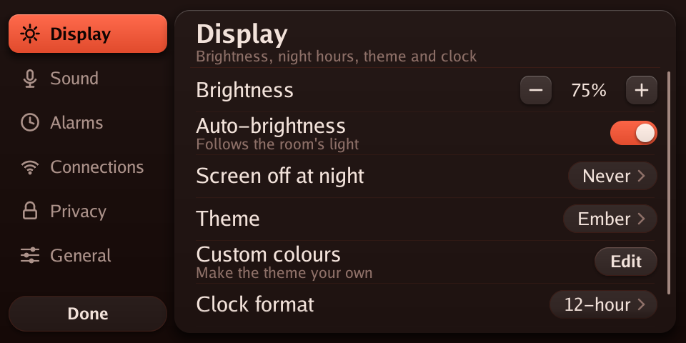
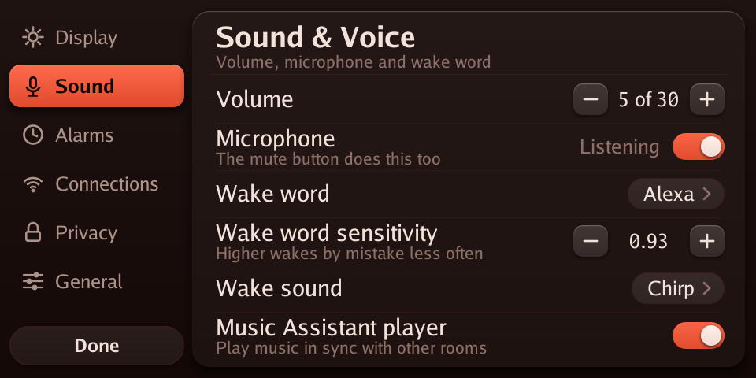
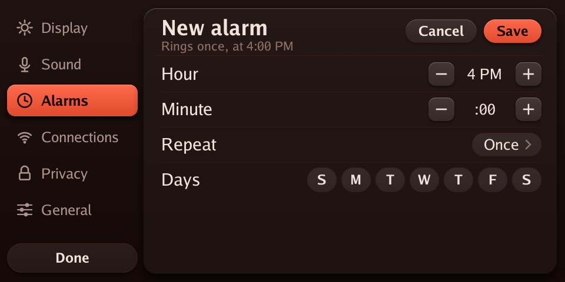
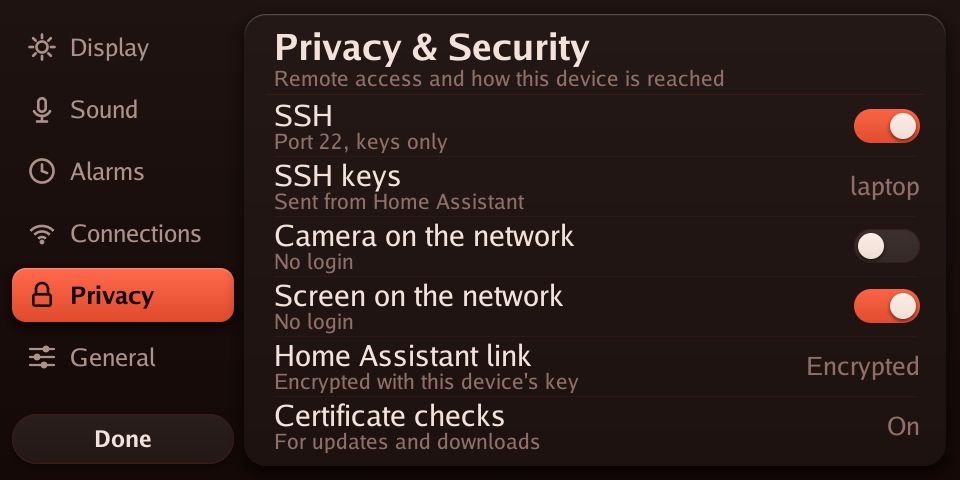
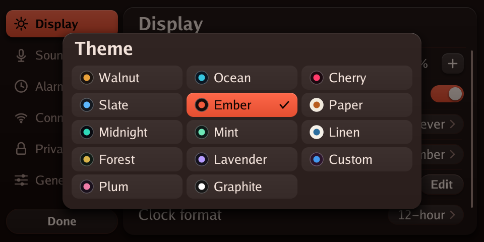
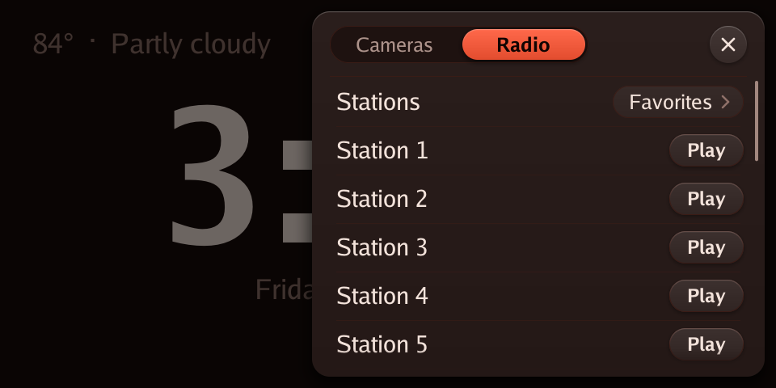

<p align="center">
  
</p>

<h3 align="center">Your Echo Show 5, rebuilt. Linux inside, Home Assistant in charge, no Amazon cloud.</h3>

<p align="center">
  <a href="https://github.com/HuskerMinion/techo5/releases/latest"></a>
  
  
  
  
  <a href="LICENSE"></a>
  <a href="https://buymeacoffee.com/huskerminion"></a>
</p>

<p align="center">
  <a href="#built-on-echolocal">Built on EchoLocal</a> ·
  <a href="#why-techo5">Why</a> ·
  <a href="#screenshots">Screenshots</a> ·
  <a href="#stock-vs-techo5">Stock vs TECHO5</a> ·
  <a href="#install">Install</a> ·
  <a href="#under-the-hood">Under the hood</a> ·
  <a href="#standing-on-shoulders">Credits</a> ·
  <a href="https://github.com/HuskerMinion/techo5-dot">TECHO5 Dot</a>
</p>

---

**TECHO5** (Tech Echo 5) is open firmware for the **Amazon Echo Show 5, 2nd generation** (2021,
`cronos`). It replaces Android and Alexa with a small Alpine Linux image and one Go daemon, turning
the Show into a fast, private Home Assistant voice satellite with a touch screen of its own.

## Built on EchoLocal

TECHO5 started from **[EchoLocal](https://github.com/ygelfand/echolocal)** by Yuri Gelfand (MIT),
which already turns the Echo Dot 2 (`biscuit`, the same MT8163 family) into an ESPHome-native Home
Assistant satellite, with a single static Go daemon that drives the hardware directly. TECHO5's
`echod` is that daemon, vendored and ported to the Show 5's `cronos`, and much of it is still
EchoLocal's code: the wake word engine, the ALSA client and the service framework almost unchanged,
and the voice satellite, media player and component registry grown from EchoLocal's own. What TECHO5
added is the Show's hardware, the screen, the camera, Bluetooth, the update and
slot system, phone calls, and a minimal Alpine root filesystem in place of Android. See
[NOTICE](NOTICE) for the full attribution and EchoLocal's license.

## Why TECHO5

|  |  |
|---|---|
| 🐧 **Real Linux, no Android** | The Show boots straight into a minimal Alpine Linux root filesystem. No Android framework, no Google services, no app store: one daemon drives the microphones, speaker, screen, camera and radios directly. |
| 🚫 **No Alexa, no Amazon account, no Amazon cloud** | Your voice goes only to *your* Home Assistant, over its encrypted ESPHome API. The Show reaches the internet just for what you use: update checks against this repo, network time, radio streams with their song and cover lookups, and the rain radar map. Voice and control keep working with the internet down, as long as your Home Assistant pipeline is local. |
| 🎙️ **Wake word on the device** | microWakeWord runs locally: "Alexa", "Okay Nabu", "Hey Jarvis" or "Hey Mycroft", chosen on the screen or in Home Assistant. Echo cancellation keeps it listening over music. |
| 🔐 **Secure by default** | SSH is keys-only and off until you turn it on; keys arrive only through Home Assistant. The camera and screen web pages start closed. No password logins, not even in rescue. |
| 🔄 **Updates that can't brick it** | Releases install over the air from Home Assistant's update card into the spare of two root filesystem slots, boot on trial, and fall back on their own if the new one doesn't settle. |
| 📺 **A screen that's actually useful** | Clock and weather, the conversation as it happens, now playing with song and cover art, forecasts and a live rain radar, live Home Assistant cameras, timers and alarms, Wi-Fi setup, 13 themes. |
| 📻 **Weather and radio with no setup** | A new Show uses the forecast every Home Assistant has, and lists the radio stations near home from Home Assistant's Radio Browser. Pick another weather entity (your own station, say) on the screen, and keep your own favorite stations too. |
| ⏰ **Alarms that ring on their own** | Set on the screen, by Home Assistant, or followed from its helpers; they ring from the Show's own clock even when Home Assistant is down. Snooze included. |
| 🎧 **Bluetooth, rebuilt** | Earbuds and speakers over A2DP, plus a Home Assistant Bluetooth proxy, on a kernel rebuilt with Bluetooth from the LineageOS source. |
| 📞 **A speakerphone again** | Calls through your own SIP provider: "call Alex" by voice, calls that ring on the screen, calls between your own devices, and a help call that alerts your phones and dials people in turn. Encrypted end to end to the provider, and off until you sign it in. [docs/phone.md](docs/phone.md) |
| 📷 **A camera you control** | The front camera becomes a Home Assistant camera entity, off unless something is watching, and physically off while the mute button is engaged. |
| 🛟 **Always recoverable** | A rescue environment with a USB serial console, and TWRP left in place: LineageOS is one flash away. |

## Screenshots

Straight from the device's own screen.

| | |
|---|---|
|  |  |
| **Clock**, weather and the next alarm | **Alarm ringing**, big enough to hit half awake |
|  |  |
| **Settings** by category: brightness, night hours, theme, clock | **Sound & Voice**: volume, microphone, wake word and its sound |
|  |  |
| **Alarms** set on the device, no app needed | **Privacy**: every open door has a switch |
|  |  |
| **Themes**: presets or your own colours | **Cameras and Radio**, a swipe in from the right |

## Stock vs TECHO5

| | Stock Echo Show 5 (Alexa) | TECHO5 |
|---|---|---|
| Operating system | Fire OS (Android) | Alpine Linux, one daemon |
| Voice assistant | Alexa, in Amazon's cloud | Home Assistant Assist, with any pipeline you run |
| Where your voice goes | Amazon | Your Home Assistant, encrypted |
| Wake word | "Alexa", processed for Amazon | On the device: Alexa, Okay Nabu, Hey Jarvis, Hey Mycroft |
| Screen | Alexa cards and ads | Clock, weather, now playing, cameras, timers, alarms, settings |
| Music | Amazon Music and skills | Home Assistant radio lists with cover art, Music Assistant (Sendspin), Home Assistant media |
| Timers and alarms | Alexa | Home Assistant timers on screen; alarms that ring without Home Assistant |
| Camera | Video calls, Drop In | A Home Assistant camera entity, off unless watched |
| Bluetooth | Speaker and phone audio | Audio to earbuds and speakers; Home Assistant Bluetooth proxy |
| Smart home | Alexa routines | Everything Home Assistant does |
| Updates | Amazon, automatic, whenever | From this repo's releases, when you press Install; A/B slots with automatic fallback |
| Remote access | None | SSH with keys, off by default |
| Listening on your network | Amazon's services | Home Assistant's encrypted API and the Sendspin player; SSH and web pages only when switched on. A signed-in phone keeps its own connection out to the provider |
| Calling | Alexa calling and Drop In | Phone calls through your own SIP provider (TLS and SRTP), placed from Home Assistant or by voice, answered on the screen; device to device calls in the house |
| Shopping, skills | Yes | **No.** Those are Alexa cloud services |

## Install

**New to this? Start with [Getting started](docs/getting-started.md)**: every step from a stock Echo
Show 5, Dot or Spot, with the unlock guides linked, what to check after each step, and notes for
Windows, Linux and macOS.

You need a Show 5 2nd gen **unlocked with
[amonet-cronos](https://xdaforums.com/t/unlock-root-twrp-unbrick-amazon-echo-show-5-2nd-gen-2021-cronos.4772596/)
and running
[LineageOS 18.1](https://xdaforums.com/t/rom-unofficial-11-cronos-lineageos-18-1-for-the-amazon-echo-show-5-2021.4772598/)**,
a USB cable, a computer (Windows, Linux or macOS) with Python 3, `adb` and `fastboot`, and Home
Assistant. Each [release](https://github.com/HuskerMinion/techo5/releases/latest) carries everything
else: the boot image (with Bluetooth) and the root filesystem. Nothing is built.

```
git clone https://github.com/HuskerMinion/techo5
cd techo5
python3 tools/install-show.py --serial <adb serial> --name "Kitchen"
```

It downloads and checks the release, flashes the boot image, creates the slot store and installs over
the USB serial console, and prints where the Home Assistant key is kept. Later updates come from Home
Assistant. Every step by hand, and the fixes for what can go wrong: **[docs/install.md](docs/install.md)**.

> **Status:** in daily use on two Echo Show 5 units. It's a hobby project, not a product: keep your
> backups, and expect rough edges.

## Under the hood

| Layer | What |
|---|---|
| Boot | Amazon's LK, unlocked with amonet; the LineageOS 4.9 kernel rebuilt with Bluetooth; a rescue initramfs that picks a slot |
| System | Alpine Linux armv7 in two root filesystem slots, read-only, with a trial-and-commit boot counter |
| Daemon | `echod`, one Go binary: audio, wake word, echo cancellation, screen renderer, touch, camera ISP, Bluetooth, updates |
| Home Assistant | The native ESPHome API: voice satellite, media player, camera, update entity, dozens of settings |

- [docs/overview.md](docs/overview.md): the one-page description of how it all fits.
- [docs/porting-plan.md](docs/porting-plan.md): how it was built, step by step, dead ends included.
- [docs/hardware.md](docs/hardware.md): the `cronos` hardware and the unlock path.
- [docs/camera-research.md](docs/camera-research.md): driving the camera's ISP from userspace.
- [docs/building.md](docs/building.md): building it yourself: where every input comes from
  (`tools/fetch-inputs.py`), and the daemon, kernel, boot image and root filesystem builds, for each OS.
- [tools/linux/README.md](tools/linux/README.md): the image tooling in detail.

## Sister project

**[TECHO5 Dot](https://github.com/HuskerMinion/techo5-dot)** does the same for the Echo Dot 2nd
generation: Linux in place of Fire OS, all seven microphones, Bluetooth speaker mode, signed
updates. Both run the same daemon source, built per device.

## Standing on shoulders

TECHO5 exists because of these projects and the people behind them.

**The path here**
- [EchoLocal](https://github.com/ygelfand/echolocal) (MIT, Yuri Gelfand): the daemon TECHO5 is built
  on (see [Built on EchoLocal](#built-on-echolocal)), and
  [go-esphome-device](https://github.com/ygelfand/go-esphome-device), the ESPHome device API it speaks.
- **amonet-cronos and kaeru** (k4y0z, [R0rt1z2](https://github.com/R0rt1z2)): the bootloader unlock
  and recovery that make any of this possible.
- [@proffalken](https://github.com/proffalken): the
  [step-by-step install from Linux](https://gist.github.com/proffalken/377ae50146affe1886dddaaacb87926b)
  that [Getting started](docs/getting-started.md) and the cross-platform installers are based on.
- **LineageOS 18.1 for `cronos`** (unofficial, R0rt1z2), built on
  [Amazon's GPL kernel source](https://github.com/amazon-oss/android_kernel_amazon_mt8163): the
  kernel TECHO5 rebuilds and the vendor drivers it keeps. [TWRP](https://twrp.me/) stays as the way back.
- [ShowAssist](https://github.com/HuskerMinion/showassist) and the
  [View Assist Companion App](https://github.com/msp1974/ViewAssistCompanionApp) (Mark Parker): what
  ran the Show before TECHO5, and the first proof it could be a Home Assistant satellite.
- [jxlarrea/lineageos-echo-show-camera](https://github.com/jxlarrea/lineageos-echo-show-camera):
  the OV02B10 camera driver and sensor fixes, the privacy latch, and echo cancellation work on the
  Echo Show family.
- [bengris32/linux-mtk](https://github.com/bengris32/linux-mtk): the mainline MT8163 effort, a map of
  the hardware.
- The BQ Aquaris E10 GPL source release: MediaTek's ISP register map for this chip generation, which
  let the camera run from userspace.

**What runs on the device**
- [microWakeWord](https://github.com/kahrendt/microWakeWord) (Kevin Ahrendt), the
  [ESPHome wake word models](https://github.com/esphome/micro-wake-word-models), and
  [zserge/microwakeword](https://github.com/zserge/microwakeword) for Go.
- [Home Assistant](https://www.home-assistant.io/) and [ESPHome](https://esphome.io/): Assist, the
  native API, and the reason to build any of this.
- [Music Assistant](https://www.music-assistant.io/) and [Sendspin](https://github.com/Sendspin/sendspin-go).
- [Radio Browser](https://www.radio-browser.info/), through Home Assistant's integration, for stations
  near home; [RainViewer](https://www.rainviewer.com/api.html) for the radar and
  [OpenStreetMap](https://www.openstreetmap.org/copyright) contributors for the map under it.
- [Alpine Linux](https://alpinelinux.org/), BusyBox, Dropbear, wpa_supplicant, [BlueZ](https://www.bluez.org/),
  [bluez-alsa](https://github.com/arkq/bluez-alsa) (arkq), and
  [webrtc-audio-processing](https://gitlab.freedesktop.org/pulseaudio/webrtc-audio-processing).
- Go libraries: go-mp3 (Hajime Hoshi), godbus, gorilla/websocket, zeroconf, mewkiz/flac, pion/opus,
  cobra, viper, protobuf and the Go fonts; for calls, [diago](https://github.com/emiago/diago) and
  [sipgo](https://github.com/emiago/sipgo) (Emir Aganovic), [Pion](https://github.com/pion) SRTP and
  RTP, and zaf/g711.

See [NOTICE](NOTICE) for licenses of code carried in this repository.

<details>
<summary>The older route: the daemon beside LineageOS (Windows, PowerShell)</summary>

Before the Linux image, the daemon ran as an init service on LineageOS 18.1. That still works, on a
unit with USB debugging and rooted debugging enabled:

```powershell
cd echod
$env:GOOS='linux'; $env:GOARCH='arm'; $env:GOARM='7'; $env:CGO_ENABLED='0'
go build -trimpath -ldflags '-s -w' -o ../bin/echod-arm ./cmd/echod
cd ..
.\tools\install-cronos.ps1 -Serial <adb serial> -Name "Kitchen" -KeyFile .\kitchen.psk
```

The installer puts the daemon in place as an init service, switches Android to its null audio HAL
(the daemon owns the microphone and speaker), provisions the name, API key and wake word models, and
reboots. Home Assistant then discovers the device as an ESPHome node; paste the key when asked.
Android and any app on the screen keep running, silently.

</details>

## License

MIT. See [LICENSE](LICENSE) and [NOTICE](NOTICE).

TECHO5 isn't affiliated with Amazon. Echo and Alexa are trademarks of Amazon.com, Inc.
