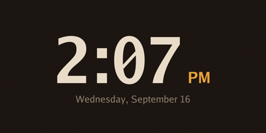
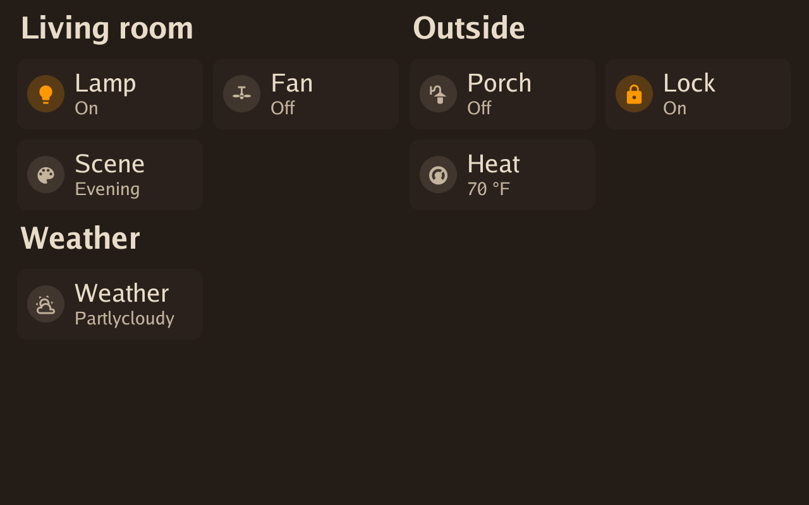
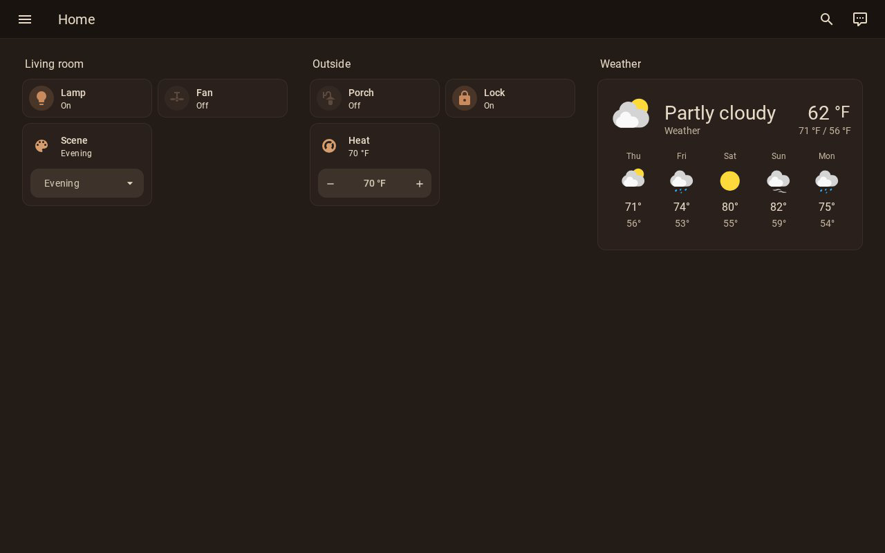
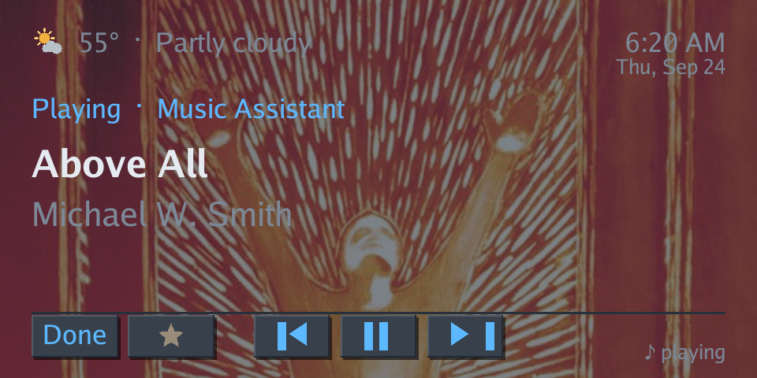
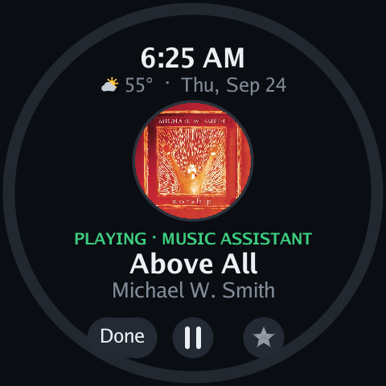
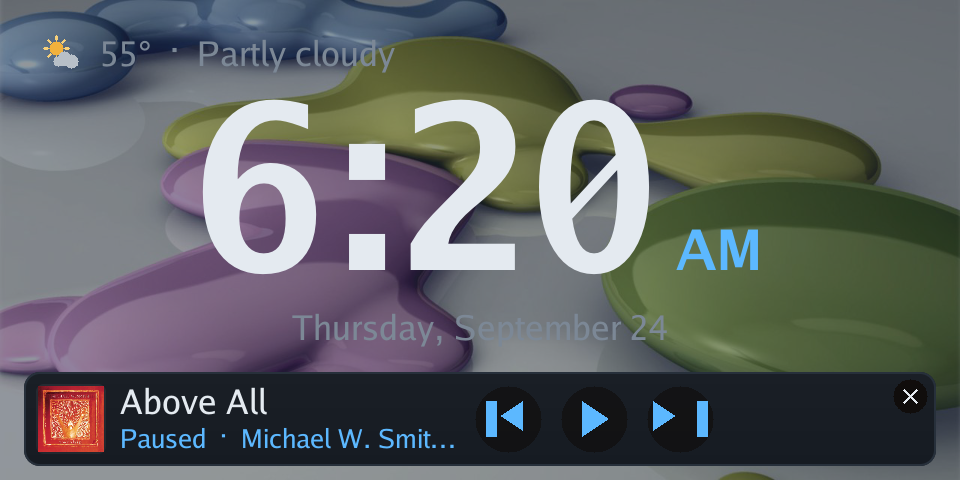
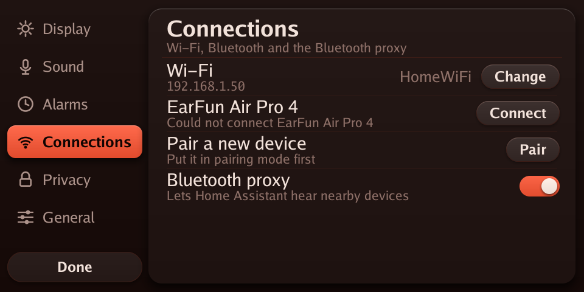
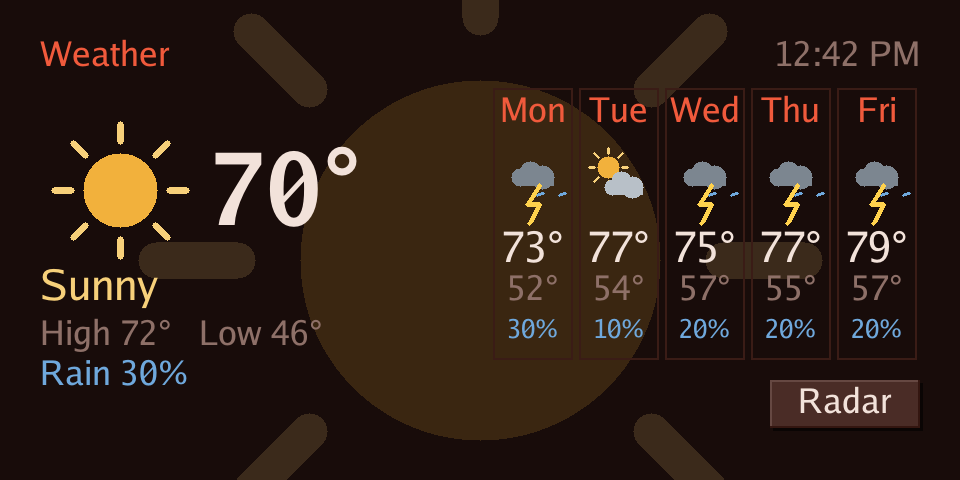
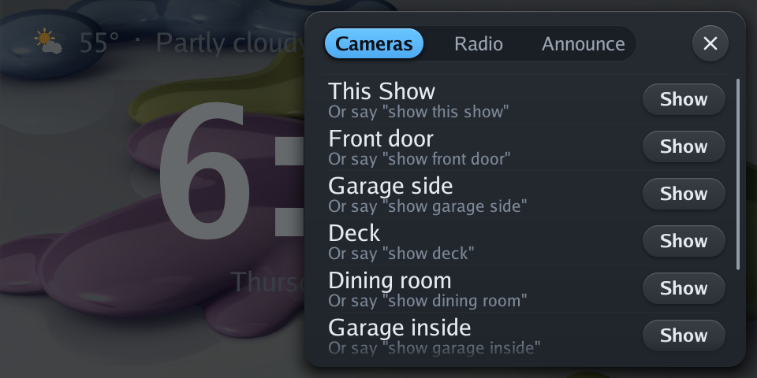
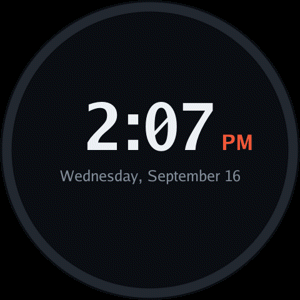

<p align="center">
  
</p>

<h3 align="center">Your Echo Show 5, rebuilt. Linux inside, Home Assistant in charge, no Amazon cloud.</h3>

<p align="center">
  <a href="https://github.com/HuskerMinion/techo5/releases/latest"></a>
  
  
  
  
  <a href="LICENSE"></a>
  <a href="https://buymeacoffee.com/huskerminion"></a>
</p>

<p align="center">
  <a href="#whats-new">What's new</a> ·
  <a href="#built-on-echolocal">Built on EchoLocal</a> ·
  <a href="#why-techo5">Why</a> ·
  <a href="#screenshots">Screenshots</a> ·
  <a href="#stock-vs-techo5">Stock vs TECHO5</a> ·
  <a href="#install">Install</a> ·
  <a href="#under-the-hood">Under the hood</a> ·
  <a href="#made-possible-by">Credits</a> ·
  <a href="https://github.com/HuskerMinion/techo5-dot">TECHO5 Dot</a> ·
  <a href="https://github.com/HuskerMinion/techo5-spot">TECHO5 Spot</a>
</p>

---

**TECHO5** (Tech Echo 5) is open firmware for the **Amazon Echo Show 5**. It replaces Android and
Alexa with a small Alpine Linux image and one Go daemon, turning the Show into a fast, private Home
Assistant voice satellite with a touch screen of its own.

**Every Echo that can be unlocked now runs it.** The bootloader exploit these devices are opened with,
[amonet](https://github.com/R0rt1z2/amonet), reaches five Amazon Echos. All five run the same daemon:

| Device | Model | Repository | Status |
|---|---|---|---|
| **Echo Show 5, 2nd gen** (2021, `cronos`) | AEOCN | this one | In daily use |
| **Echo Show 5, 1st gen** (2019, `checkers`) | AEOCH | this one, same binary; hardware notes in [techo5-checkers](https://github.com/HuskerMinion/techo5-checkers) | Working, tested end to end on one unit |
| **Echo Show 8, 1st gen** (2019, `crown`) | AEOCW | this one, same binary | Working on one unit, the newest port |
| **Echo Spot, 1st gen** (2017, `rook`) | VN94DQ | [TECHO5 Spot](https://github.com/HuskerMinion/techo5-spot) | In daily use |
| **Echo Dot, 2nd gen** (2016, `biscuit`) | RS03QR | [TECHO5 Dot](https://github.com/HuskerMinion/techo5-dot) | In daily use |

Every other device amonet opens is a Fire tablet. No Echo made after 2021 has a public unlock, so this
is the whole family as it stands, not a roadmap.

<p align="center">
  
</p>

<p align="center">
  <em><strong>Waking to light.</strong> For up to half an hour before an alarm the screen becomes a
  dawn, on a curve that does most of its work near the end. Every frame here is drawn by the code
  the device draws with.</em>
</p>

## What's new

The bigger changes of late September 2026. Every release lists the rest.

<table>
<tr>
<td width="50%"><a href="docs/screenshots/show8/dashboard-drawn.png"></a></td>
<td width="50%"><a href="docs/screenshots/show8/dashboard-streamed.png"></a></td>
</tr>
<tr>
<td><strong>Drawn on the device</strong>: instant, no server</td>
<td><strong>Streamed</strong>: exactly as Home Assistant draws it</td>
</tr>
</table>

**Home Assistant dashboards on the screen** (v0.9.0). The Echo Show and the Echo Spot can show a
dashboard as a page you swipe in from the left edge of the clock (on the Spot, from the ring menu),
or in place of the clock when nothing else is on the screen. There are two ways, picked per device in
Home Assistant:

- **Drawn on the device.** The device reads the dashboard's cards and draws them itself, in your
  theme's colors: tiles you can tap or slide for brightness, position and temperature, rows with
  switches, graphs, gauges, pictures and more. Taps are instant and nothing else is needed. With no
  dashboard picked, it builds a Rooms dashboard from your Home Assistant areas.
- **Streamed.** [dashcast](dashcast/README.md), a small server that runs next to Home Assistant
  (a Docker image for PCs and Raspberry Pis), opens the dashboard in a headless browser and sends the
  screen only what changes, encrypted with a key of your choosing. It looks exactly as Home Assistant
  draws it, custom cards included, and it can show built-in pages like Energy and History.

Which to use, how to set it up and what each can do: **[docs/dashboards.md](docs/dashboards.md)**.

<table>
<tr>
<td width="50%"><a href="docs/screenshots/now-playing-cover.png"></a></td>
<td width="50%"><a href="docs/screenshots/spot/now-playing-cover.png"></a></td>
</tr>
<tr>
<td colspan="2"><strong>Cover art for Music Assistant</strong> (v0.8.13). Music from Music Assistant, your own library included, now shows its album cover on the now-playing screen, the way radio stations already did. Music Assistant sends the picture itself, so there's nothing to set up. On the Spot it sits in a circle over the song.</td>
</tr>
</table>

- 🗣️ **It stops listening when you stop talking** (v0.8.14). After the wake word, the device hears
  you finish and ends the turn itself, instead of waiting for Home Assistant. With a TV or other
  voices in the room, that used to mean 10 to 15 seconds of listening, or a turn that timed out and
  did nothing. A switch per device, *End of speech on the device*, puts it back the old way.
- 🌙 **A night light** (v0.8.12, v0.8.13). Night hours can dim the screen to a faint glow instead of
  turning it off, and the first touch only brings it up. Music playing at night no longer keeps it
  bright, and *Night light brightness* (1 to 10) in Home Assistant sets the glow.
  [Screenshot](docs/screenshots/night-light.png)
- 🎵 **Music that behaves** (v0.8.9 to v0.8.13). A mini player strip over the clock with its own
  controls, Done and a favorite star on the now-playing page, pause and play that keep your place
  with Music Assistant, and answers and announcements that play over the music, ducked, instead of
  stopping it. Two ways a device could end up saying "Playing" in silence are fixed.
  [Screenshot](docs/screenshots/now-playing-strip.png)
- ⏰ **Alarms and reminders** (v0.8.1 onward). An alarm or reminder can ring once on a particular
  day, each alarm can choose its own wake light, and reminders can be set by voice ("remind me
  every Wednesday at 8 to take the trash out") with the automation in
  [docs/actions.md](docs/actions.md#stop-a-ring-and-set-reminders-by-voice).
  [Screenshot](docs/screenshots/alarm-editor.png)
- 🔁 **A Restart button** in Home Assistant for every device (v0.8.13): restarts the TECHO5 software
  the way an update does, for when something is stuck and you'd rather not unplug it.
- 🌧️ **Sleep sounds** (v0.8.14). "Play the sounds of rain" no longer brings up the forecast, and a
  sound file served by Home Assistant shows its own name on the now-playing page.
- 🎙️ **More by voice**, with ready-made Home Assistant automations in
  [docs/actions.md](docs/actions.md#set-cancel-and-list-alarms-and-change-the-volume-by-voice):
  set, cancel and list alarms ("cancel the 6 AM alarm", "what alarms do I have"), and change the
  volume on the speaker you're talking to rather than every speaker in the room.
- 📺 **The Echo Show 8** (v0.8.0) runs the same software, laid out for its bigger screen.
  [Screenshots](docs/screenshots/README.md#echo-show-8)

## Built on EchoLocal

TECHO5 started from **[EchoLocal](https://github.com/ygelfand/echolocal)** by Yuri Gelfand (MIT),
which already turns the Echo Dot 2 (`biscuit`, the same MT8163 family) into an ESPHome-native Home
Assistant satellite, with a single static Go daemon that drives the hardware directly. TECHO5's
`echod` is that daemon, vendored and ported to the Show 5's `cronos`, and much of it is still
EchoLocal's code: the wake word engine, the ALSA client and the service framework almost unchanged,
and the voice satellite, media player and component registry grown from EchoLocal's own. What TECHO5
added is the Show's hardware, the screen, the camera, Bluetooth, the update and
slot system, phone calls, and a minimal Alpine root filesystem in place of Android. See
[NOTICE](NOTICE) for the full attribution and EchoLocal's license.

## Why TECHO5

|  |  |
|---|---|
| 🐧 **Real Linux, no Android** | The Show boots straight into a minimal Alpine Linux root filesystem. No Android framework, no Google services, no app store: one daemon drives the microphones, speaker, screen, camera and radios directly. |
| 🚫 **No Alexa, no Amazon account, no Amazon cloud** | Your voice goes only to *your* Home Assistant, over its encrypted ESPHome API. The Show reaches the internet just for what you use: update checks against this repo, network time, radio streams with their song and cover lookups, the rain radar map, and in the U.S. the National Weather Service's weather alerts. Voice and control keep working with the internet down, as long as your Home Assistant pipeline is local. |
| 🎙️ **Wake word on the device** | microWakeWord runs locally: twelve wake words, "Alexa", "Okay Nabu", "Hey Jarvis", "Hey Mycroft", "Computer" and more, chosen on the screen or in Home Assistant. Echo cancellation keeps it listening over music. |
| 🔐 **Secure by default** | SSH is keys-only and off until you turn it on; keys arrive only through Home Assistant. The camera and screen web pages start closed. No password logins, not even in rescue. |
| 🔄 **Updates that can't brick it** | Releases install over the air from Home Assistant's update card into the spare of two root filesystem slots, boot on trial, and fall back on their own if the new one doesn't settle. |
| 📺 **A screen that's actually useful** | Clock and weather, the conversation as it happens, now playing with song and cover art, your Home Assistant dashboards, forecasts, a live rain radar, the National Weather Service's alerts (in the U.S.), live Home Assistant cameras, timers and alarms, Wi-Fi setup, 13 themes. |
| 📻 **Weather and radio with no setup** | A new Show uses the forecast every Home Assistant has, and lists the radio stations near home from Home Assistant's Radio Browser. Pick another weather entity (your own station, say) on the screen, and keep your own favorite stations too. |
| ⏰ **Alarms that ring on their own** | Set on the screen, by Home Assistant, or followed from its helpers; they ring from the Show's own clock even when Home Assistant is down. Snooze included, and the screen can wake you with a sunrise before the sound. |
| 🎧 **Bluetooth, rebuilt** | Earbuds and speakers over A2DP, plus a Home Assistant Bluetooth proxy, on a kernel rebuilt with Bluetooth from the LineageOS source. |
| 📞 **A speakerphone again** | Calls through your own SIP provider: "call Alex" by voice, calls that ring on the screen, calls between your own devices, and a help call that alerts your phones and dials people in turn. Encrypted end to end to the provider, and off until you sign it in. [docs/phone.md](docs/phone.md) |
| 📷 **A camera you control** | The front camera becomes a Home Assistant camera entity, off unless something is watching, and physically off while the mute button is engaged. |
| 🛟 **Always recoverable** | A rescue environment with a USB serial console, and TWRP left in place: LineageOS is one flash away. |

## Screenshots

Straight from the device's own screen. **[All of them](docs/screenshots/README.md)**, including the
Echo Show 8 and the Echo Spot, are in [docs/screenshots](docs/screenshots/README.md).

| | |
|---|---|
|  |  |
| **Clock**, weather and your own photos behind it | **Alarm ringing**, big enough to hit half awake |
|  |  |
| **Now playing**, with the album's cover | **The mini player**, over the clock |
|  |  |
| **Settings** by category: brightness, night hours, theme, clock | **Sound & Voice**: volume, microphone, wake word and its sound |
|  |  |
| **Alarms** set on the device, no app needed | **Privacy**: every open door has a switch |
|  |  |
| **Themes**: presets or your own colors | **Connections**: Wi-Fi, Bluetooth and the Home Assistant proxy |
|  |  |
| **Weather** now and for the week, with the rain radar a tap away | **Cameras and Radio**, a swipe in from the right |

<p align="center">
  
</p>

<p align="center">
  <em>The <strong>Echo Spot</strong> takes the same twenty minutes across its round face.</em>
</p>

## Stock vs TECHO5

| | Stock Echo Show 5 (Alexa) | TECHO5 |
|---|---|---|
| Operating system | Fire OS (Android) | Alpine Linux, one daemon |
| Voice assistant | Alexa, in Amazon's cloud | Home Assistant Assist, with any pipeline you run |
| Where your voice goes | Amazon | Your Home Assistant, encrypted |
| Wake word | "Alexa", processed for Amazon | On the device: Alexa, Okay Nabu, Hey Jarvis, Hey Mycroft and eight more |
| Screen | Alexa cards and ads | Clock, weather, now playing, Home Assistant dashboards, cameras, timers, alarms, settings |
| Music | Amazon Music and skills | Home Assistant radio lists with cover art, Music Assistant (Sendspin), Home Assistant media |
| Timers and alarms | Alexa | Home Assistant timers on screen; alarms that ring without Home Assistant |
| Camera | Video calls, Drop In | A Home Assistant camera entity, off unless watched |
| Bluetooth | Speaker and phone audio | Audio to earbuds and speakers; Home Assistant Bluetooth proxy |
| Smart home | Alexa routines | Everything Home Assistant does |
| Updates | Amazon, automatic, whenever | From this repo's releases, when you press Install; A/B slots with automatic fallback |
| Remote access | None | SSH with keys, off by default |
| Listening on your network | Amazon's services | Home Assistant's encrypted API and the Sendspin player; SSH and web pages only when switched on. A signed-in phone keeps its own connection out to the provider |
| Calling | Alexa calling and Drop In | Phone calls through your own SIP provider (TLS and SRTP), placed from Home Assistant or by voice, answered on the screen; device to device calls in the house |
| Shopping, skills | Yes | **No.** Those are Alexa cloud services |

## Install

**New to this? Start with [Getting started](docs/getting-started.md)**: every step from a stock Echo
Show 5, Dot or Spot, with the unlock guides linked, what to check after each step, and notes for
Windows, Linux and macOS.

You need a Show 5 **unlocked and running LineageOS 18.1** — 2nd gen with
[amonet-cronos](https://xdaforums.com/t/unlock-root-twrp-unbrick-amazon-echo-show-5-2nd-gen-2021-cronos.4772596/)
and [this ROM](https://xdaforums.com/t/rom-unofficial-11-cronos-lineageos-18-1-for-the-amazon-echo-show-5-2021.4772598/),
1st gen with
[amonet-checkers](https://xdaforums.com/t/unlock-root-twrp-unbrick-amazon-echo-show-5-1st-gen-2019-checkers.4762900/)
and R0rt1z2's `checkers` build of the same LineageOS — a USB cable, a computer (Windows, Linux or macOS) with Python 3, `adb` and `fastboot`, and Home
Assistant. Each [release](https://github.com/HuskerMinion/techo5/releases/latest) carries everything
else: the boot image (with Bluetooth) and the root filesystem. Nothing is built.

```
git clone https://github.com/HuskerMinion/techo5
cd techo5
python3 tools/install-show.py
```

It finds the Show, asks what to call it and asks once before erasing anything (or takes
`--serial`, `--name` and `--force` from a script), downloads and checks the release, flashes the boot image, creates the slot store and installs over
the USB serial console, and prints where the Home Assistant key is kept. Later updates come from Home
Assistant. Every step by hand, and the fixes for what can go wrong: **[docs/install.md](docs/install.md)**.

> **Status:** in daily use on two Echo Show 5 units. It's a hobby project, not a product: keep your
> backups, and expect rough edges.

**Echo Show 5 1st gen (2019, `checkers`)** installs with the same command: the installer sees which
generation it is talking to and takes that unit's boot image from the release. Everything works on it —
screen, touch, speaker, microphones, wake word, camera, the mute button and voice — tested end to end,
though so far on one unit rather than the two years of daily use behind the 2nd gen. The hardware notes
are in [techo5-checkers](https://github.com/HuskerMinion/techo5-checkers).

**Echo Show 8 1st gen (2019, `crown`)** installs with the same command as well. Its screen, touch,
speaker, four microphones, wake word, camera, lens cover and mute latch all work, and it takes slot
updates like the others. It is the newest of the three and has been through far less use than either
Show 5, so treat it as such. Two things worth knowing first: a seller's model number does not tell the
two Show 8 generations apart, so go by the year when buying second-hand, and cycling the mute latch
stops the camera until the unit is rebooted.

## Under the hood

| Layer | What |
|---|---|
| Boot | Amazon's LK, unlocked with amonet; the LineageOS 4.9 kernel rebuilt with Bluetooth; a rescue initramfs that picks a slot |
| System | Alpine Linux armv7 in two root filesystem slots, read-only, with a trial-and-commit boot counter |
| Daemon | `echod`, one Go binary: audio, wake word, echo cancellation, screen renderer, touch, camera ISP, Bluetooth, updates |
| Home Assistant | The native ESPHome API: voice satellite, media player, camera, update entity, dozens of settings |

- [docs/overview.md](docs/overview.md): the one-page description of how it all fits.
- [docs/porting-plan.md](docs/porting-plan.md): how it was built, step by step, dead ends included.
- [docs/hardware.md](docs/hardware.md): the `cronos` hardware and the unlock path.
- [docs/camera-research.md](docs/camera-research.md): driving the camera's ISP from userspace.
- [docs/building.md](docs/building.md): building it yourself: where every input comes from
  (`tools/fetch-inputs.py`), and the daemon, kernel, boot image and root filesystem builds, for each OS.
- [tools/linux/README.md](tools/linux/README.md): the image tooling in detail.

## Sister projects

**[TECHO5 Dot](https://github.com/HuskerMinion/techo5-dot)** does the same for the Echo Dot 2nd
generation: Linux in place of Fire OS, all seven microphones, Bluetooth speaker mode, signed
updates. **[TECHO5 Spot](https://github.com/HuskerMinion/techo5-spot)** does it for the Echo Spot
(1st gen), on its round screen. All three run the same daemon source, built per device.

## Made possible by

TECHO5 exists because of these projects and the people behind them.

**The path here**
- [EchoLocal](https://github.com/ygelfand/echolocal) (MIT, Yuri Gelfand): the daemon TECHO5 is built
  on (see [Built on EchoLocal](#built-on-echolocal)), and
  [go-esphome-device](https://github.com/ygelfand/go-esphome-device), the ESPHome device API it speaks.
- **amonet-cronos and kaeru** (k4y0z, [R0rt1z2](https://github.com/R0rt1z2)): the bootloader unlock
  and recovery that make any of this possible.
- [@proffalken](https://github.com/proffalken): the
  [step-by-step install from Linux](https://gist.github.com/proffalken/377ae50146affe1886dddaaacb87926b)
  that [Getting started](docs/getting-started.md) and the cross-platform installers are based on.
- **LineageOS 18.1 for `cronos`** (unofficial, R0rt1z2), built on
  [Amazon's GPL kernel source](https://github.com/amazon-oss/android_kernel_amazon_mt8163): the
  kernel TECHO5 rebuilds and the vendor drivers it keeps. [TWRP](https://twrp.me/) stays as the way back.
- ShowAssist and the
  [View Assist Companion App](https://github.com/msp1974/ViewAssistCompanionApp) (Mark Parker): what
  ran the Show before TECHO5, and the first proof it could be a Home Assistant satellite.
- [jxlarrea/lineageos-echo-show-camera](https://github.com/jxlarrea/lineageos-echo-show-camera):
  the OV02B10 camera driver and sensor fixes, the privacy latch, and echo cancellation work on the
  Echo Show family.
- [bengris32/linux-mtk](https://github.com/bengris32/linux-mtk): the mainline MT8163 effort, a map of
  the hardware.
- The BQ Aquaris E10 GPL source release: MediaTek's ISP register map for this chip generation, which
  let the camera run from userspace.
- [@Empty2k12](https://github.com/Empty2k12): the first hardware findings from an Echo Show 5 1st gen
  (`checkers`), including the recipe that made its speaker play, in
  [pull request #2](https://github.com/HuskerMinion/techo5/pull/2).
- [@JonGilmore](https://github.com/JonGilmore): every 1st gen build tested on a real unit, two days of
  it. The microphones, the mute latch cutting their power, the camera and the spoken replies were all
  found or confirmed from what he reported.

**What runs on the device**
- [microWakeWord](https://github.com/kahrendt/microWakeWord) (Kevin Ahrendt), the
  [ESPHome wake word models](https://github.com/esphome/micro-wake-word-models), and
  [zserge/microwakeword](https://github.com/zserge/microwakeword) for Go.
- [Home Assistant](https://www.home-assistant.io/) and [ESPHome](https://esphome.io/): Assist, the
  native API, and the reason to build any of this.
- [Music Assistant](https://www.music-assistant.io/) and [Sendspin](https://github.com/Sendspin/sendspin-go).
- [Radio Browser](https://www.radio-browser.info/), through Home Assistant's integration, for stations
  near home.
- The rain map and weather alerts: the U.S. [National Weather Service](https://www.weather.gov/) for
  the radar and the [alerts](https://www.weather.gov/documentation/services-web-api) (public domain),
  with the radar's map tiles from the [Iowa Environmental Mesonet](https://mesonet.agron.iastate.edu/)
  at Iowa State University; [RainViewer](https://www.rainviewer.com/api.html) for the radar outside the
  U.S.; NASA's [GIBS](https://www.earthdata.nasa.gov/engage/open-data-services-software/earthdata-developer-portal/gibs-api)
  for the Blue Marble map and NOAA's GOES satellites' clouds; and
  [GeoNames](https://www.geonames.org/) (CC BY 4.0) for the town names.
- [Alpine Linux](https://alpinelinux.org/), BusyBox, Dropbear, wpa_supplicant, [BlueZ](https://www.bluez.org/),
  [bluez-alsa](https://github.com/arkq/bluez-alsa) (arkq), and
  [webrtc-audio-processing](https://gitlab.freedesktop.org/pulseaudio/webrtc-audio-processing).
- Go libraries: go-mp3 (Hajime Hoshi), godbus, gorilla/websocket, zeroconf, mewkiz/flac, pion/opus,
  cobra, viper, protobuf and the Go fonts; for calls, [diago](https://github.com/emiago/diago) and
  [sipgo](https://github.com/emiago/sipgo) (Emir Aganovic), [Pion](https://github.com/pion) SRTP and
  RTP, and zaf/g711.

See [NOTICE](NOTICE) for licenses of code carried in this repository.

<details>
<summary>The older route: the daemon beside LineageOS (Windows, PowerShell)</summary>

Before the Linux image, the daemon ran as an init service on LineageOS 18.1. That still works, on a
unit with USB debugging and rooted debugging enabled:

```powershell
cd echod
$env:GOOS='linux'; $env:GOARCH='arm'; $env:GOARM='7'; $env:CGO_ENABLED='0'
go build -trimpath -ldflags '-s -w' -o ../bin/echod-arm ./cmd/echod
cd ..
.\tools\install-cronos.ps1 -Serial <adb serial> -Name "Kitchen" -KeyFile .\kitchen.psk
```

The installer puts the daemon in place as an init service, switches Android to its null audio HAL
(the daemon owns the microphone and speaker), provisions the name, API key and wake word models, and
reboots. Home Assistant then discovers the device as an ESPHome node; paste the key when asked.
Android and any app on the screen keep running, silently.

</details>

## License

MIT. See [LICENSE](LICENSE) and [NOTICE](NOTICE).

TECHO5 isn't affiliated with Amazon. Echo and Alexa are trademarks of Amazon.com, Inc.
